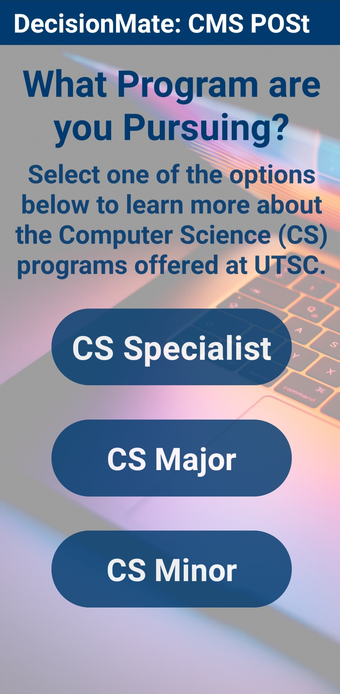

## DecisionMate: Your Guide to Navigating CMS POSt

Being a first-year Computer and Mathematical Sciences (CMS) student at the University of Toronto Scarborough (UTSC) is a challenging experience. Students are transitioning from high school, dealing with heavier workloads and learning challenging concepts in their courses. It can even be more stressful for students to determine if they have qualified for thier Program of Study (POSt). They must meet certain grade requirements so they can enter a Computer Science, Mathematics or Statistics program in their second year that they will continue wiht until graduation. Otherwise, they will need to transfer to another program.

Therefore, I developed DecisionMate, which is designed to assist UTSC CMS students in determining their eligibility for POSt. The app provides a user-friendly interface where students answer simple questions to determine if they are eligible for various CMS programs. They can also input thier marks to check if they meet grade requirements for differents program. This makes life easier for students because the main information about qualifying for POSt can be found in one place, and they may use the UTSC CMS webiste if they would like to explore programs or courses further.

As of January 2024, this app is currently in **beta version**. It only provides information about CS POSt. However, I will be updating the app for the Mathematics and Statistics programs soon.

## Features

- **Determine if you Qualify for all CS Programs**

