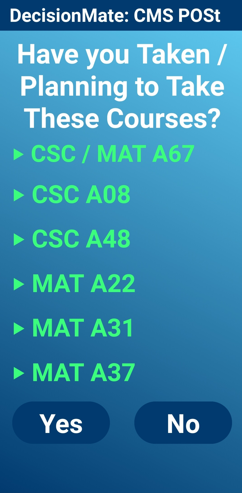
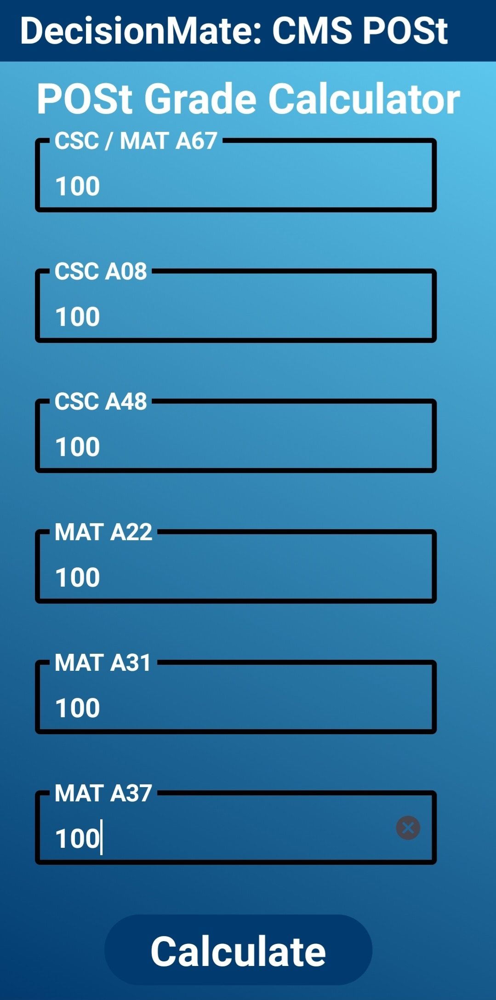

## DecisionMate: Your Guide to Navigating CMS POSt

Being a first-year Computer and Mathematical Sciences (CMS) student at the University of Toronto Scarborough (UTSC) is a challenging experience. Students need to adjust to university life from high school, manage heavy workloads and learn challenging concepts in their courses. It can even be more stressful for students to determine if they have qualified for their Program of Study (POSt). They must meet certain grade requirements so they can enter a Computer Science, Mathematics or Statistics program in their second year that they will continue with until graduation. If students do not qualify for a CMS POSt, they will need to transfer to another program.

Therefore, I developed DecisionMate, an Android application to assist UTSC CMS students in determining their eligibility for POSt. The app provides a user-friendly interface where students answer simple questions about the courses they have taken and admisson category to determine if they are eligible for various CMS programs. They can also input their marks to check if they meet grade requirements for different program. This makes life easier for students because the main information about qualifying for POSt can be found in one place, and they may use the UTSC CMS website if they would like to explore programs or courses further.

As of January 2024, this app is currently in **beta version**. It only provides information about CS POSt. However, I will be updating the app for the Mathematics and Statistics programs soon.

## Features

- **Determine if you Qualify for all CS Specialist, Major and Minor Programs**
 

- **Verify if you Have the Right Courses for your POSt**

- **Check Admission Information for In-Stream and Out-of-Stream Students**

- **Check Admission Information for In-Stream and Out-of-Stream Students**

## Getting Started

1. **Download the App:**
- The app will be available soon on the Google Play Store.

2. **Usage:**
- Open the app, answer the questions about your chosen POSt and input your grades if necessary.

3. **Results:**
- Receive instant feedback on your eligibility for CS POSt.

## Feedback and Support

If you encounter any issues or have suggestions for improvement, please leave a review or reach out to me at shakjivraj87@gmail.com.

## Technologies Used

  

